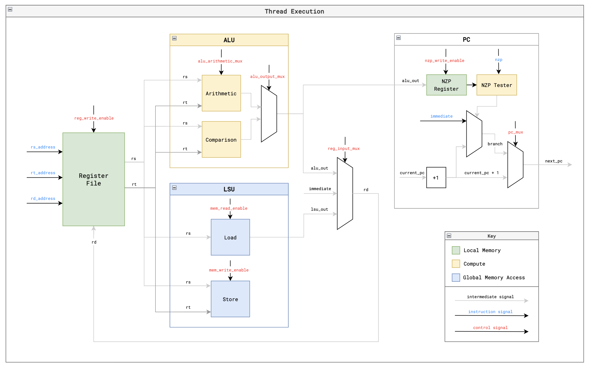

# MiniGPU

A **minimal GPU implementation in Verilog** optimized for learning how GPUs work from the ground up.

---

Built with **<15 files** of fully documented Verilog, complete documentation on **architecture & ISA**, working **matrix addition/multiplication kernels**, and full support for **kernel simulation & execution traces**.

---

## Table of Contents

- [Overview](#overview)
- [Architecture](#architecture)
  - [GPU](#gpu)
  - [Memory](#memory)
  - [Core](#core)
- [ISA](#isa)
- [Execution](#execution)
  - [Core](#core-execution)
  - [Thread](#thread)
- [Kernels](#kernels)
  - [Matrix Addition](#matrix-addition)
  - [Matrix Multiplication](#matrix-multiplication)
- [Simulation](#simulation)
- [Advanced Functionality](#advanced-functionality)
- [Next Steps](#next-steps)


---

## What is tiny-gpu?

> A minimal GPU implementation for **learning** how general-purpose GPUs and ML accelerators (like Google's TPU) work.

We simplify GPUs by:

- Removing graphics-specific complexity
- Focusing on general architectural principles
- Demonstrating **SIMD**, **memory bandwidth constraints**, and **thread scheduling**

---

## Architecture

### GPU

The GPU executes a single kernel at a time:

1. Load program memory with kernel code
2. Load data memory with input
3. Set thread count in control register
4. Set start signal high

#### GPU Components

- **Device Control Register** – Holds thread count
- **Dispatcher** – Sends thread blocks to compute cores
- **Compute Cores** – Handle SIMD execution
- **Memory Controllers** – Interface with global memory
- **Cache** *(WIP)* – Improve memory reuse

---

### Memory

#### Global Memory Specs

- **Data Memory**: 256 rows, 8-bit addressable, 8-bit data
- **Program Memory**: 256 rows, 8-bit addressable, 16-bit data

#### Memory Controllers

- Queue and throttle requests to global memory
- Return responses to correct cores

#### Cache (WIP)

- SRAM-based data reuse
- Prevents redundant memory fetches

---

## Core

Each core processes one block at a time.

Each thread has:

- ALU
- LSU
- PC
- Register file

### Scheduler

- Executes all threads in sync
- Waits on memory accesses
- No pipelining (yet)

### Fetcher

- Gets instruction at current PC

### Decoder

- Converts instruction into control signals

### Register Files

- 16 registers (R0–R12 for general use, 3 for `%blockIdx`, `%blockDim`, `%threadIdx`)

### ALUs

- Handle `ADD`, `SUB`, `MUL`, `DIV`, and `CMP`
- Update NZP (Negative-Zero-Positive) flag

### LSUs

- Perform `LDR` and `STR` operations asynchronously

### PCs

- Support `BRnzp` instructions for loops and conditionals
- All threads must converge at each PC (naïve model)


---


## ISA

11-instruction set architecture:

| Instruction | Function |
|-------------|----------|
| `BRnzp`     | Conditional branch |
| `CMP`       | Compare two registers |
| `ADD`/`SUB`/`MUL`/`DIV` | Arithmetic ops |
| `LDR`/`STR` | Load/store from/to memory |
| `CONST`     | Load constant |
| `RET`       | End thread |

- Registers: `R0–R12` general-purpose, `R13–R15` for block/thread metadata

---

## Execution

### Core Execution Flow

1. **FETCH** – Get instruction from PC
2. **DECODE** – Convert to signals
3. **REQUEST** – Read/write memory if needed
4. **WAIT** – Wait for memory if async
5. **EXECUTE** – Do computation
6. **UPDATE** – Write results, set flags

---

### Thread

Each thread:

- Runs with its own register file
- Uses `%blockIdx`, `%blockDim`, and `%threadIdx` for indexing
- Follows SIMD model

---



## Kernels

### Matrix Addition

Adds two 1x8 matrices element-wise.

```asm
.threads 8
.data 0 1 2 3 4 5 6 7
.data 0 1 2 3 4 5 6 7

MUL R0, %blockIdx, %blockDim
ADD R0, R0, %threadIdx

CONST R1, #0
CONST R2, #8
CONST R3, #16

ADD R4, R1, R0
LDR R4, R4

ADD R5, R2, R0
LDR R5, R5

ADD R6, R4, R5

ADD R7, R3, R0
STR R7, R6

RET
```

---

### Matrix Multiplication

Multiplies two 2x2 matrices.

```asm
.threads 4
.data 1 2 3 4
.data 1 2 3 4

MUL R0, %blockIdx, %blockDim
ADD R0, R0, %threadIdx

CONST R1, #1
CONST R2, #2
CONST R3, #0
CONST R4, #4
CONST R5, #8

DIV R6, R0, R2
MUL R7, R6, R2
SUB R7, R0, R7

CONST R8, #0
CONST R9, #0

LOOP:
  MUL R10, R6, R2
  ADD R10, R10, R9
  ADD R10, R10, R3
  LDR R10, R10

  MUL R11, R9, R2
  ADD R11, R11, R7
  ADD R11, R11, R4
  LDR R11, R11

  MUL R12, R10, R11
  ADD R8, R8, R12

  ADD R9, R9, R1

  CMP R9, R2
  BRn LOOP

ADD R9, R5, R0
STR R9, R8

RET
```

---

## Simulation

### Prerequisites

- `iverilog`: `brew install icarus-verilog`
- `cocotb`: `pip3 install cocotb`
- `sv2v`: [Download](https://github.com/zachjs/sv2v/releases) and place in `$PATH`
- Run `mkdir build` in root

### To Run

```bash
make test_matadd
make test_matmul
```

### Output

Check `test/logs/` for:

- Initial and final data memory
- Complete per-cycle execution trace

---

## Advanced Functionality

- Caches for memory reuse (WIP)
- Warp scheduling
- Instruction pipelining
- Branch divergence resolution

---

## Next Steps

Want to understand how production-grade GPUs optimize execution? Head to the [Advanced Functionality](#advanced-functionality) section and try implementing:

- Memory coalescing
- Warp divergence handling
- Shared memory banks
- Hardware loop unrolling

---

If you try this project or run into issues, feel free to reach out via Twitter DM. I'd love to help!


## Attached Files-

**src** folder contains all the Verilog datapath and control path files and the top files.

The two GPU 101 PDFs contain the CUDA concepts/implementation process in GPU. 

MiniGPU files contains all the details of each code's framework and logic blocks, and datapath/control-path.

MiniGPU_CUDA contains the notes about CUDA made by me.

SoC_notes_SIMD contains the notes for the SIMD architecture.


